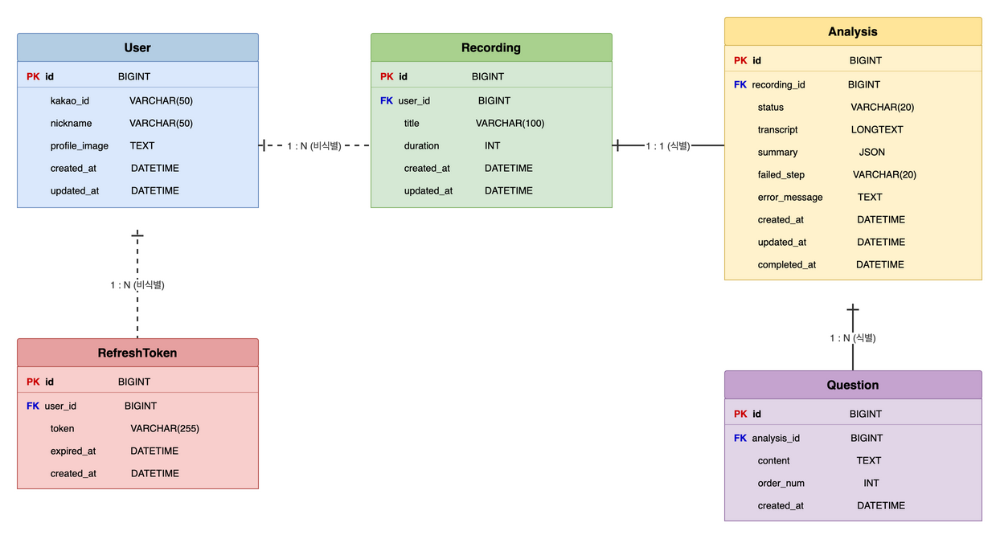

## ERD

## 주요 테이블 정의

### User (사용자)

| 컬럼 | 타입 | 제약조건 | 설명 |
|------|------|---------|------|
| id | BIGINT | PK, AUTO_INCREMENT | 사용자 고유 ID |
| kakao_id | VARCHAR(50) | UNIQUE, NOT NULL | 카카오 고유 식별자 |
| nickname | VARCHAR(50) | | 카카오 닉네임 |
| profile_image | TEXT | | 카카오 프로필 이미지 URL |
| created_at | DATETIME | NOT NULL | 가입일시 |
| updated_at | DATETIME | NOT NULL | 수정일시 |

### Recording (녹음)

| 컬럼 | 타입 | 제약조건 | 설명 |
|------|------|---------|------|
| id | BIGINT | PK, AUTO_INCREMENT | 녹음 고유 ID |
| user_id | BIGINT | FK → User.id, NOT NULL | 소유 사용자 |
| title | VARCHAR(100) | NOT NULL | 녹음 제목 (미입력 시 자동 생성) |
| duration | INT | | 녹음 길이 (초) |
| created_at | DATETIME | NOT NULL | 생성일시 |
| updated_at | DATETIME | NOT NULL | 수정일시 |

### Analysis (분석)

| 컬럼 | 타입 | 제약조건 | 설명 |
|------|------|---------|------|
| id | BIGINT | PK, AUTO_INCREMENT | 분석 고유 ID |
| recording_id | BIGINT | FK → Recording.id, UNIQUE, NOT NULL | 대상 녹음 |
| status | VARCHAR(20) | NOT NULL | 분석 상태 (PENDING / STT / SUMMARIZING / QUESTIONING / COMPLETED / FAILED) |
| transcript | LONGTEXT | | STT 변환 텍스트 |
| summary | JSON | | AI 요약본 (구조화된 JSON) |
| failed_step | VARCHAR(20) | | 실패 단계 (재시도 시 사용) |
| error_message | TEXT | | 에러 메시지 |
| created_at | DATETIME | NOT NULL | 분석 요청일시 |
| updated_at | DATETIME | NOT NULL | 상태 변경일시 |
| completed_at | DATETIME | | 분석 완료일시 |

### Question (심화 질문)

| 컬럼 | 타입 | 제약조건 | 설명 |
|------|------|---------|------|
| id | BIGINT | PK, AUTO_INCREMENT | 질문 고유 ID |
| analysis_id | BIGINT | FK → Analysis.id, NOT NULL | 소속 분석 |
| content | TEXT | NOT NULL | 질문 내용 |
| order_num | INT | NOT NULL | 질문 순서 (1~5) |
| created_at | DATETIME | NOT NULL | 생성일시 |

### RefreshToken (리프레시 토큰)

| 컬럼 | 타입 | 제약조건 | 설명 |
|------|------|---------|------|
| id | BIGINT | PK, AUTO_INCREMENT | 토큰 고유 ID |
| user_id | BIGINT | FK → User.id, NOT NULL | 소유 사용자 |
| token | VARCHAR(255) | UNIQUE, NOT NULL | 리프레시 토큰 값 |
| expired_at | DATETIME | NOT NULL | 토큰 만료일시 |
| created_at | DATETIME | NOT NULL | 발급일시 |
