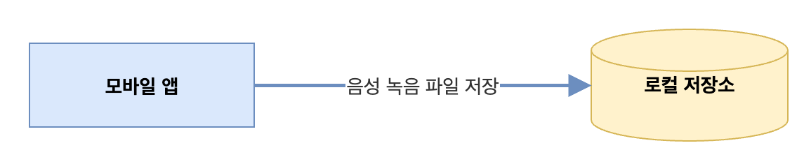
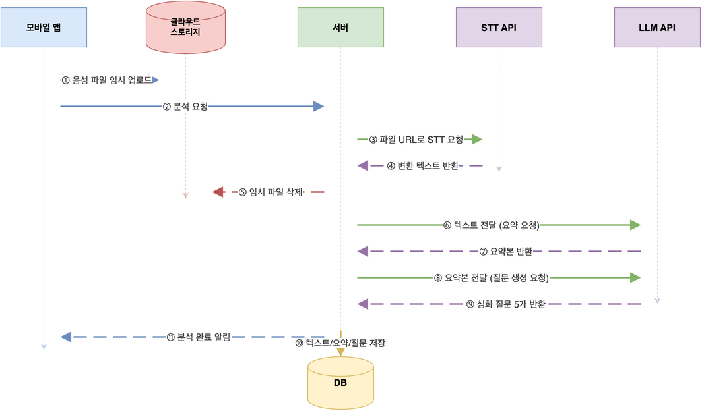
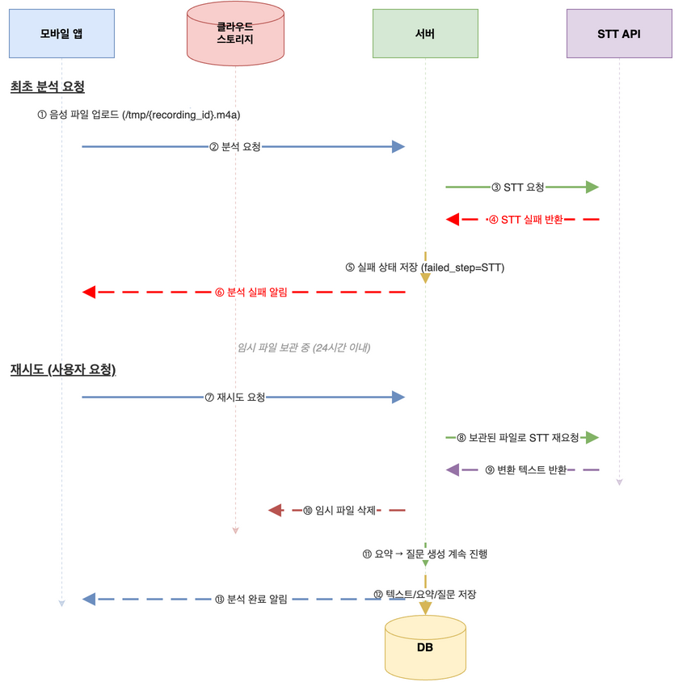
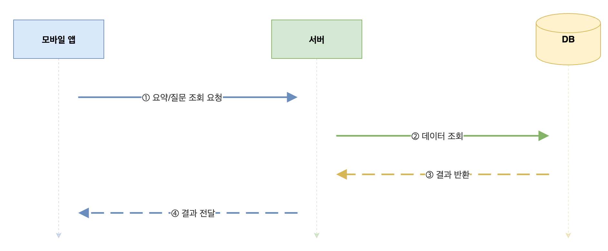
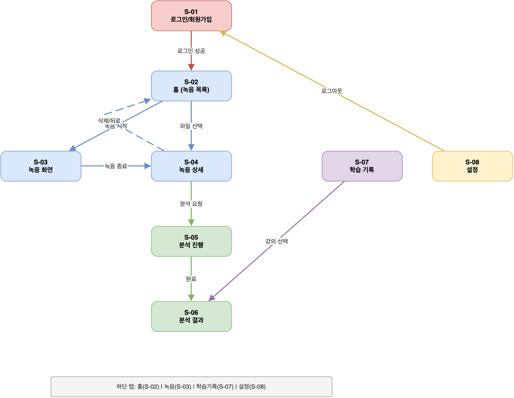
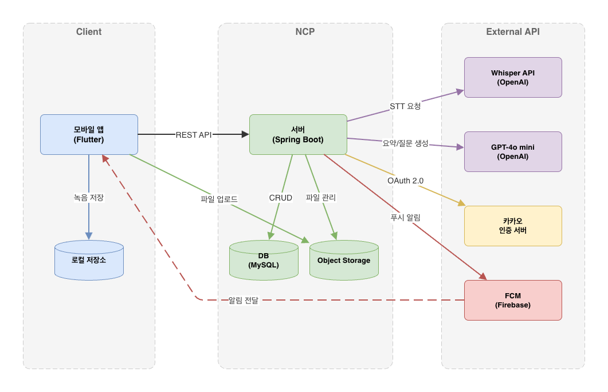
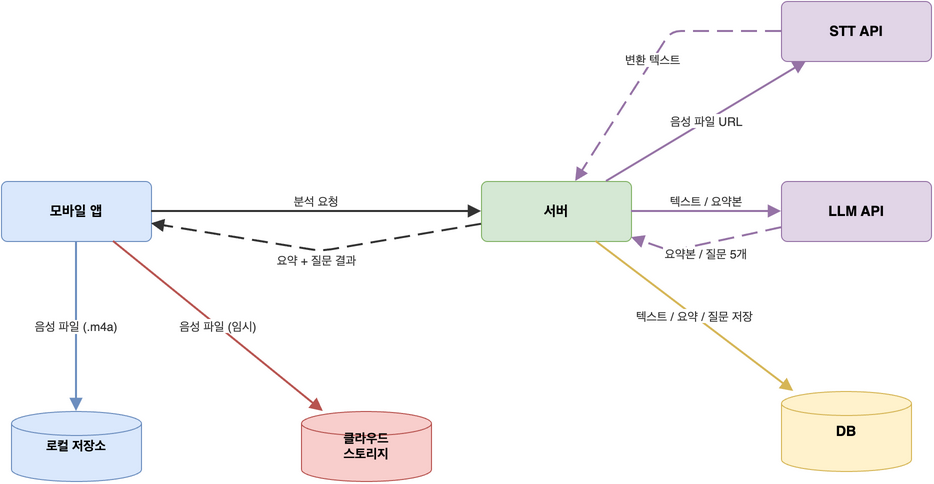
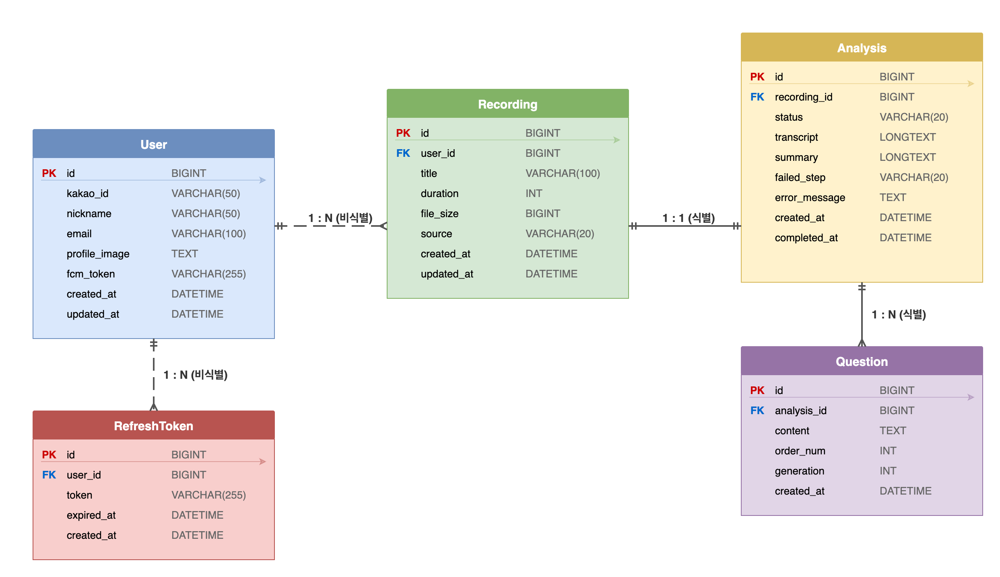

## 1. 프로젝트 개요

### 1.1 프로젝트 배경
- 학생들은 강의 후 이해했다고 느끼지만, 실제로는 표면적 이해에 머무르는 경우가 많음
- 심화 질문을 통한 학습이 효과적이나, 학생이 직접 질문을 만들기는 어려움
- 강의 녹음은 쉽게 할 수 있지만, 이를 학습에 활용할 수 있는 도구가 부족함

### 1.2 문제 정의
- **표면적 이해**: 강의 직후 "안다"고 느끼지만, 핵심 개념을 응용하지 못함
- **자기 질문의 어려움**: 복습을 위한 심화 질문을 스스로 만들기 어려움
- **녹음의 낮은 활용도**: 녹음해도 다시 듣는 경우가 드물고, 학습으로 연결되지 않음

### 1.3 서비스 목표
모바일 앱에서 강의를 녹음하고, 사용자가 분석을 요청하면 AI가 강의 내용을 분석하여 **심화 질문을 자동 생성**한다. 학생이 더 깊이 학습할 수 있도록 유도하는 것이 핵심 목표이다.

- **녹음의 학습 자산화**: 녹음을 텍스트 변환·요약·질문으로 전환하여 실질적 학습 자료로 활용
- **AI 심화 질문 제공**: 강의 내용 기반의 다양한 유형의 질문을 자동 생성
- **자기 주도 복습 유도**: 심화 질문을 통해 학생이 스스로 깊이 사고하도록 유도

### 1.4 타깃 사용자
- **대학생**: 전공 강의 복습, 시험 대비
- **온라인 강의 수강생**: 자기 주도 학습, 이해도 점검
- **자격증/시험 준비생**: 핵심 개념 정리, 취약 부분 파악

---

## 2. 요구사항 정의

### 2.1 기능 요구사항

#### FR-01. 강의 녹음 `필수`
사용자가 앱 내에서 강의를 실시간 녹음할 수 있다.
- 녹음 시작/일시정지/종료 제어
- 녹음 중 경과 시간 표시
- 백그라운드 녹음 지원
- 녹음 파일 로컬 저장 및 목록 관리
- 녹음 최대 길이: 2시간, 최대 파일 크기: 200MB (초과 시 자동 종료 및 안내)
- 녹음 파일 삭제 (단, 분석 진행 중인 녹음은 삭제 불가)
- 녹음 제목 편집

#### FR-02. 외부 음성 파일 가져오기 `보통`
외부에서 녹음된 음성 파일을 앱으로 가져올 수 있다.
- mp3, m4a 등 주요 오디오 포맷 지원
- 가져온 파일 최대 크기: 200MB (초과 시 가져오기 거부 및 안내)
- 가져온 파일은 앱 내 녹음과 동일하게 관리

#### FR-03. 음성-텍스트 변환(STT) `필수`
녹음된 음성을 텍스트로 변환한다. 분석 일괄 처리(FR-06)의 첫 번째 단계로 실행된다.
- 한국어 음성 인식 지원
- 변환 진행 상태는 분석 상태 조회 API를 통해 확인 (FR-06)
- 변환된 텍스트 별도 열람 가능
- 변환 결과가 빈 텍스트인 경우 (무음, 인식 불가 등) 분석 실패로 처리하고 사용자에게 안내

#### FR-04. 강의 내용 요약 `필수`
변환된 텍스트를 AI가 분석하여 핵심 내용을 요약한다.
- 핵심 개념(용어 + 정의) 추출
- 주제별 섹션으로 구조화된 요약본 생성 (JSON 형식)
- 핵심 키워드 추출
- 요약 결과 저장 및 재열람

#### FR-05. AI 심화 질문 자동 생성 `필수`
FR-04의 요약본을 기반으로 심화 질문을 자동 생성한다.
- 요약된 핵심 개념에 대한 응용·추론·비판적 사고를 요구하는 심화 질문 생성
- 녹음 건당 5개 질문 생성
- 질문 재생성 요청 가능 (기존 질문을 새 질문으로 대체)

#### FR-06. 분석 일괄 처리 `필수`
사용자가 수동으로 분석을 요청하면 STT 변환 → 요약 → 질문 생성을 하나의 작업으로 일괄 처리한다.
- 녹음 선택 후 단일 버튼으로 전체 파이프라인 실행 (사용자당 동시 분석 1건으로 제한)
- 각 단계(STT/요약/질문 생성)의 진행 상태 표시
- 중간 단계 실패 시 해당 단계부터 재시도 가능 (재업로드 불필요)
  - STT 실패 시: 클라우드 임시 파일을 활용하여 재시도 (24시간 이내)
  - 요약 실패 시: DB에 저장된 변환 텍스트로 재시도 (시간 제한 없음)
  - 질문 생성 실패 시: DB에 저장된 요약본으로 재시도 (시간 제한 없음)
- 음성 파일은 클라우드 스토리지에 `/tmp/{recording_id}.m4a` 경로로 업로드
- STT 성공 시 클라우드 음성 파일 즉시 삭제
- STT 실패 시 클라우드 음성 파일 보관 (24시간 후 자동 삭제)
- 앱이 백그라운드 상태일 때 분석 완료 또는 실패 시 푸시 알림

#### FR-07. 학습 기록 관리 `보통`
사용자의 학습 이력을 관리하고 진행 상황을 확인할 수 있다.
- 강의별 녹음/질문 이력 조회
- 날짜/키워드별 필터링 및 검색

#### FR-08. 사용자 인증 `필수`
소셜 로그인 기반의 간편 인증으로 개인 데이터를 보호한다.
- 소셜 로그인 (카카오)
- 첫 로그인 시 자동 회원가입
- 개인 학습 데이터 계정 연동
- 로그아웃 및 계정 탈퇴
- 분석 진행 중인 경우 탈퇴 불가 (분석 완료 또는 실패 후 탈퇴 가능)

### 2.2 비기능 요구사항

- **NFR-01 | 안정성** — 앱 비정상 종료 시에도 녹음 파일 유실 방지 (FR-01)
- **NFR-02 | 안정성** — 분석 중 네트워크 오류 발생 시 실패 단계부터 재시도 가능. STT 실패의 경우 클라우드 임시 파일 보관 기간(24시간) 이내에만 재시도 가능 (FR-06, NFR-07)
- **NFR-03 | 보안** — 인증 토큰 안전한 저장 (FR-08)
- **NFR-04 | 보안** — 녹음 파일 및 학습 데이터 암호화 저장 (FR-01, FR-07)
- **NFR-05 | 성능** — 동시 다수 사용자의 분석 요청을 안정적으로 처리 (FR-06)
- **NFR-06 | 호환성** — iOS 15+, Android 12+ 지원
- **NFR-07 | 스토리지** — STT 실패 시 클라우드 임시 음성 파일을 24시간 후 자동 삭제하여 스토리지 누수 방지 (FR-06)

---

## 3. 서비스 흐름

### 3.1 주요 사용자 플로우

#### 플로우 1. 강의 녹음 및 심화 질문 생성 (핵심 플로우)
1. 사용자가 소셜 로그인으로 앱에 접속한다 (FR-08)
2. 강의 녹음을 시작한다 (FR-01)
3. 강의 종료 후 녹음을 중지한다 (FR-01)
4. 녹음 목록에서 해당 녹음을 선택하고 분석을 요청한다 (FR-06)
5. STT 변환 → 요약 → 질문 생성이 순차적으로 진행된다 (FR-03, FR-04, FR-05)
6. 분석 완료 후 심화 질문을 확인하고 스스로 사고한다 (FR-05)

#### 플로우 2. 외부 파일로 심화 질문 생성
1. 외부에서 녹음한 음성 파일을 앱으로 가져온다 (FR-02)
2. 이후 플로우 1의 4~6단계와 동일

#### 플로우 3. 질문 재생성
1. 생성된 심화 질문이 만족스럽지 않을 때 재생성을 요청한다 (FR-05)
2. 기존 질문이 삭제되고 새로운 심화 질문 5개로 대체된다 (FR-05)

#### 플로우 4. 학습 기록 조회
1. 학습 기록 화면에서 날짜/키워드별로 필터링한다 (FR-07)
2. 특정 강의의 녹음, 요약, 질문 이력을 확인한다 (FR-07)

### 3.2 시스템 흐름

#### 강의 녹음 단계



#### 분석 요청 단계



#### STT 변환 실패 시 재시도 단계

STT 단계에서 실패할 경우, 클라우드에 보관된 음성 파일을 활용하여 재업로드 없이 재시도할 수 있다. 요약/질문 생성 단계의 실패는 DB에 이전 단계 결과가 저장되어 있으므로 별도 파일 없이 바로 재시도가 가능하다.



**최초 분석 요청 (STT 실패)**
1. 앱이 음성 파일을 클라우드 스토리지에 업로드한다 (`/tmp/{recording_id}.m4a`)
2. 앱이 서버에 분석을 요청한다
3. 서버가 STT API에 음성 파일 URL로 변환을 요청한다
4. STT API가 변환 실패를 반환한다
5. 서버가 실패 상태를 DB에 저장한다 (`failed_step=STT`)
6. 서버가 앱에 분석 실패를 알린다

> STT 실패 시 클라우드 음성 파일은 삭제하지 않고 보관한다 (24시간 후 자동 삭제)

**재시도 (사용자 요청)**

7. 사용자가 재시도 버튼을 누르면 앱이 서버에 재시도를 요청한다
8. 서버가 보관된 파일(`/tmp/{recording_id}.m4a`)로 STT API에 재요청한다
9. STT API가 변환 텍스트를 반환한다
10. 서버가 클라우드 임시 파일을 삭제한다
11. 서버가 요약 → 질문 생성을 계속 진행한다
12. 서버가 텍스트/요약/질문을 DB에 저장한다
13. 서버가 앱에 분석 완료를 알린다

> 24시간이 경과하여 임시 파일이 삭제된 경우, 재시도가 불가하며 분석을 새로 요청해야 한다.

#### 결과 조회 단계



---

## 4. 화면 설계

### 4.1 주요 화면 구성

| 화면 ID | 화면명 | 설명 | 관련 FR |
|---------|--------|------|---------|
| S-01 | 로그인 | 소셜 로그인 화면 (카카오) | FR-08 |
| S-02 | 홈 (녹음 목록) | 녹음 파일 목록, 녹음 시작 버튼, 파일 가져오기 | FR-01, FR-02 |
| S-03 | 녹음 화면 | 녹음 진행 중 화면 (시작/일시정지/종료, 경과 시간) | FR-01 |
| S-04 | 녹음 상세 | 녹음 정보 확인, 제목 편집, 분석 요청 버튼, 삭제 | FR-01, FR-06 |
| S-05 | 분석 진행 | 분석 단계별 진행 상태 표시 (STT → 요약 → 질문 생성) | FR-06 |
| S-06 | 분석 결과 | 요약본 + 심화 질문 5개 표시, 질문 재생성 버튼 | FR-04, FR-05 |
| S-07 | 학습 기록 | 날짜/키워드별 필터링, 강의별 이력 목록 | FR-07 |
| S-08 | 설정 | 계정 정보, 로그아웃, 계정 탈퇴 | FR-08 |

### 4.2 화면 간 전환 흐름



---

## 5. 시스템 아키텍처

### 5.1 전체 시스템 구조도



| 컴포넌트 | 역할 | 비고 |
|---------|------|------|
| 모바일 앱 | 녹음, UI, 사용자 인터랙션 | Flutter (iOS/Android 크로스플랫폼) |
| 서버 | 비즈니스 로직, API 제공, 인증 처리 | Spring Boot |
| DB | 사용자, 녹음 메타데이터, 요약, 질문 저장 | MySQL |
| 클라우드 스토리지 | 음성 파일 임시 업로드 (STT 처리용) | NCP Object Storage |
| STT API | 음성 → 텍스트 변환 | Whisper API |
| LLM API | 텍스트 요약, 심화 질문 생성 | OpenAI API (GPT-4o mini) |
| 카카오 인증 서버 | 소셜 로그인 OAuth 2.0 처리 | Kakao Developers |

### 5.2 데이터 흐름도



#### 주요 데이터 항목별 저장 위치

| 데이터 | 생성 시점 | 저장 위치 |
|--------|----------|----------|
| 음성 녹음 파일 | 녹음 완료 | 로컬 저장소 (앱) |
| 음성 파일 (임시) | 분석 요청 | 클라우드 스토리지 `/tmp/{recording_id}.m4a` → STT 성공 시 즉시 삭제, STT 실패 시 24시간 후 자동 삭제 |
| 변환 텍스트 | STT 완료 | DB |
| 요약본 | LLM 요약 완료 | DB |
| 심화 질문 (5개) | LLM 질문 생성 완료 | DB |
| 사용자 정보 | 최초 소셜 로그인 | DB |
| 인증 토큰 (JWT) | 로그인 | 앱 (Secure Storage) |

---

## 6. 기술 스택

| 구분 | 기술 | 선정 이유 |
|------|------|----------|
| **프론트엔드** | Flutter | iOS/Android 크로스플랫폼 단일 코드베이스, 빠른 개발 속도 |
| **백엔드** | Spring Boot (Java) | 안정적인 REST API 구축, 풍부한 생태계 및 레퍼런스 |
| **DB** | MySQL | 정형 데이터(사용자, 녹음, 요약, 질문) 관리에 적합, 널리 사용되어 운영 안정성 확보 |
| **인프라** | NCP (Naver Cloud Platform) | Object Storage(음성 파일 임시 저장), 서버 호스팅, 국내 리전으로 낮은 지연 |
| **STT** | OpenAI Whisper API | 한국어 인식 정확도 우수, API 기반으로 별도 인프라 불필요 |
| **LLM** | OpenAI API (GPT-4o mini) | 요약 및 질문 생성에 충분한 성능, 비용 효율적 |
| **인증** | 카카오 로그인 (OAuth 2.0) | 국내 사용자 접근성 높음, 대학생 대부분 카카오 계정 보유 |
| **상태 관리** | Riverpod (Flutter) | Flutter 공식 권장 상태 관리, 간결한 코드 구조 |
| **API 통신** | Dio (Flutter) | HTTP 클라이언트, 인터셉터 기반 토큰 관리 용이 |
| **푸시 알림** | Firebase Cloud Messaging | 크로스플랫폼 푸시 알림 지원, 무료 |

## 7. 데이터 설계

### 7.1 ERD



### 7.2 주요 테이블 정의

#### User (사용자)

| 컬럼 | 타입 | 제약조건 | 설명 |
|------|------|---------|------|
| id | BIGINT | PK, AUTO_INCREMENT | 사용자 고유 ID |
| kakao_id | VARCHAR(50) | UNIQUE, NOT NULL | 카카오 고유 식별자 |
| nickname | VARCHAR(50) | | 카카오 닉네임 |
| email | VARCHAR(100) | | 카카오 이메일 |
| profile_image | TEXT | | 카카오 프로필 이미지 URL |
| fcm_token | VARCHAR(255) | | 푸시 알림용 FCM 토큰 |
| created_at | DATETIME | NOT NULL | 가입일시 |
| updated_at | DATETIME | NOT NULL | 수정일시 |

#### Recording (녹음)

| 컬럼 | 타입 | 제약조건 | 설명 |
|------|------|---------|------|
| id | BIGINT | PK, AUTO_INCREMENT | 녹음 고유 ID |
| user_id | BIGINT | FK → User.id, NOT NULL | 소유 사용자 |
| title | VARCHAR(100) | NOT NULL | 녹음 제목 (미입력 시 서버에서 자동 생성: "3월 24일 녹음 (2)") |
| duration | INT | | 녹음 길이 (초) |
| file_size | BIGINT | | 파일 크기 (bytes) |
| source | VARCHAR(20) | NOT NULL | 녹음 출처 (APP / IMPORT) |
| created_at | DATETIME | NOT NULL | 생성일시 |
| updated_at | DATETIME | NOT NULL | 수정일시 |

#### Analysis (분석)

| 컬럼 | 타입 | 제약조건 | 설명 |
|------|------|---------|------|
| id | BIGINT | PK, AUTO_INCREMENT | 분석 고유 ID |
| recording_id | BIGINT | FK → Recording.id, UNIQUE, NOT NULL | 대상 녹음 |
| status | VARCHAR(20) | NOT NULL | 분석 상태 (PENDING / STT / SUMMARIZING / QUESTIONING / COMPLETED / FAILED) |
| transcript | LONGTEXT | | STT 변환 텍스트 |
| summary | JSON | | AI 요약본 (구조화된 JSON) |
| failed_step | VARCHAR(20) | | 실패 단계 (재시도 시 사용) |
| error_message | TEXT | | 에러 메시지 |
| created_at | DATETIME | NOT NULL | 분석 요청일시 |
| completed_at | DATETIME | | 분석 완료일시 |

#### Question (심화 질문)

| 컬럼 | 타입 | 제약조건 | 설명 |
|------|------|---------|------|
| id | BIGINT | PK, AUTO_INCREMENT | 질문 고유 ID |
| analysis_id | BIGINT | FK → Analysis.id, NOT NULL | 소속 분석 |
| content | TEXT | NOT NULL | 질문 내용 |
| order_num | INT | NOT NULL | 질문 순서 (1~5) |
| created_at | DATETIME | NOT NULL | 생성일시 |

#### RefreshToken (리프레시 토큰)

| 컬럼 | 타입 | 제약조건 | 설명 |
|------|------|---------|------|
| id | BIGINT | PK, AUTO_INCREMENT | 토큰 고유 ID |
| user_id | BIGINT | FK → User.id, NOT NULL | 소유 사용자 |
| token | VARCHAR(255) | UNIQUE, NOT NULL | 리프레시 토큰 값 |
| expired_at | DATETIME | NOT NULL | 토큰 만료일시 |
| created_at | DATETIME | NOT NULL | 발급일시 |

---

## 8. API 설계

### 8.1 공통 사항

- **Base URL**: `/api/v1`
- **인증**: Authorization 헤더에 Bearer JWT 토큰
- **응답 형식**: JSON
- **공통 응답 구조**: 모든 API 응답은 아래 구조로 래핑됩니다.

```json
{
  "status": 200,
  "message": "성공",
  "data": { ... }
}
```

- **공통 에러 응답 구조**:

```json
{
  "status": 400,
  "message": "에러 메시지",
  "data": null
}
```

- **공통 에러 코드**:

| HTTP 상태 코드 | 의미 | 설명 |
|---------------|------|------|
| 400 | Bad Request | 요청 형식 오류, 필수 파라미터 누락, 유효성 검증 실패 |
| 401 | Unauthorized | 인증 토큰 누락 또는 만료 |
| 403 | Forbidden | 해당 리소스에 대한 접근 권한 없음 (타인의 녹음 등) |
| 404 | Not Found | 요청한 리소스가 존재하지 않음 |
| 409 | Conflict | 리소스 상태 충돌 (이미 분석 진행 중/완료 등) |
| 410 | Gone | 요청한 리소스가 더 이상 존재하지 않음 (임시 파일 만료 등) |
| 413 | Payload Too Large | 요청 데이터(파일 등)가 허용 크기 초과 |
| 429 | Too Many Requests | 동시 요청 과다, 잠시 후 재시도 필요 |
| 500 | Internal Server Error | 서버 내부 오류 |

- **401 에러 응답 예시**:
```json
{
  "status": 401,
  "message": "인증 토큰이 만료되었습니다.",
  "data": null
}
```

- **403 에러 응답 예시**:
```json
{
  "status": 403,
  "message": "해당 리소스에 대한 접근 권한이 없습니다.",
  "data": null
}
```

- **404 에러 응답 예시**:
```json
{
  "status": 404,
  "message": "녹음을 찾을 수 없습니다.",
  "data": null
}
```

### 8.2 인증 (Auth)

| Method | Endpoint | 설명 | 인증 |
|--------|----------|------|------|
| POST | `/auth/login` | 카카오 소셜 로그인 | X |
| POST | `/auth/refresh` | 토큰 재발급 | X |
| POST | `/auth/logout` | 로그아웃 | X (Refresh Token) |
| DELETE | `/auth/withdraw` | 회원 탈퇴 | O |

### POST /auth/login

카카오에서 받은 Access Token으로 로그인합니다. 첫 로그인 시 자동 회원가입됩니다. (FR-08)

- **인증**: 불필요

- **Request Body**
```json
{
  "kakaoAccessToken": "카카오 Access Token"
}
```

- **Response Body (200)**
```json
{
  "status": 200,
  "message": "로그인 성공",
  "data": {
    "accessToken": "JWT Access Token",
    "refreshToken": "JWT Refresh Token",
    "user": {
      "id": 1,
      "nickname": "홍길동",
      "email": "hong@kakao.com",
      "profileImage": "https://..."
    }
  }
}
```

- **Error Response**

| 상태 코드 | 상황 | 응답 메시지 |
|----------|------|-----------|
| 400 | kakaoAccessToken 누락 | "카카오 Access Token은 필수입니다." |
| 401 | 유효하지 않은 카카오 토큰 | "카카오 인증에 실패했습니다." |

### POST /auth/refresh

Refresh Token으로 새로운 토큰 쌍을 발급합니다.

- **인증**: 불필요

- **Request Body**
```json
{
  "refreshToken": "기존 Refresh Token"
}
```

- **Response Body (200)**
```json
{
  "status": 200,
  "message": "토큰 재발급 성공",
  "data": {
    "accessToken": "새 JWT Access Token",
    "refreshToken": "새 JWT Refresh Token"
  }
}
```

- **Error Response**

| 상태 코드 | 상황 | 응답 메시지 |
|----------|------|-----------|
| 400 | refreshToken 누락 | "Refresh Token은 필수입니다." |
| 401 | 만료되거나 유효하지 않은 Refresh Token | "유효하지 않은 Refresh Token입니다." |

### POST /auth/logout

현재 사용자의 Refresh Token을 무효화합니다. Access Token 만료와 무관하게 Refresh Token으로 인증합니다. (FR-08)

- **인증**: 불필요

- **Request Body**
```json
{
  "refreshToken": "현재 Refresh Token"
}
```

- **Response Body (200)**
```json
{
  "status": 200,
  "message": "로그아웃 완료",
  "data": null
}
```

- **Error Response**

| 상태 코드 | 상황 | 응답 메시지 |
|----------|------|-----------|
| 400 | refreshToken 누락 | "Refresh Token은 필수입니다." |
| 401 | 유효하지 않은 Refresh Token | "유효하지 않은 Refresh Token입니다." |

> **프론트엔드 처리**: 로그아웃 요청 실패 시에도 로컬에 저장된 토큰을 삭제하여 클라이언트 측 로그아웃을 보장한다.

### DELETE /auth/withdraw

회원 탈퇴를 처리합니다. 사용자 데이터 및 관련 녹음/분석/질문 데이터가 모두 삭제됩니다. (FR-08)

- **인증**: Bearer Token 필요

- **Request Body**

없음

- **Response Body (200)**
```json
{
  "status": 200,
  "message": "회원 탈퇴 완료",
  "data": null
}
```

- **Error Response**

| 상태 코드 | 상황 | 응답 메시지 |
|----------|------|-----------|
| 401 | 인증 토큰 누락 또는 만료 | "인증 토큰이 만료되었습니다." |
| 409 | 분석 진행 중 | "분석이 진행 중입니다. 완료 후 다시 시도해주세요." |

> **프론트엔드 처리**: Access Token 만료 시 `/auth/refresh`로 토큰을 재발급한 후 탈퇴를 재요청한다. (Dio 인터셉터에서 자동 처리)

---

### 8.3 녹음 (Recording)

| Method | Endpoint | 설명 | 인증 |
|--------|----------|------|------|
| GET | `/recordings` | 녹음 목록 조회 | O |
| GET | `/recordings/{id}` | 녹음 상세 조회 | O |
| POST | `/recordings` | 녹음 등록 | O |
| PATCH | `/recordings/{id}` | 녹음 정보 수정 (제목) | O |
| DELETE | `/recordings/{id}` | 녹음 삭제 | O |
### GET /recordings

녹음 목록을 커서 기반 무한 스크롤로 조회합니다. 날짜/키워드 필터링을 지원합니다. (FR-01, FR-07)

- **인증**: Bearer Token 필요

- **Query Parameters**

| 파라미터 | 타입 | 필수 | 설명 |
|---------|------|------|------|
| keyword | String | X | 제목 검색 |
| startDate | String | X | 조회 시작일 (yyyy-MM-dd) |
| endDate | String | X | 조회 종료일 (yyyy-MM-dd) |
| cursor | Long | X | 이전 응답의 `nextCursor` 값 (최초 요청 시 생략) |
| size | Int | X | 한 번에 불러올 개수 (기본: 20) |

- **Response Body (200)**
```json
{
  "status": 200,
  "message": "녹음 목록 조회 성공",
  "data": {
    "content": [
      {
        "id": 5,
        "title": "운영체제 3주차",
        "duration": 2700,
        "analysisStatus": "COMPLETED",
        "createdAt": "2026-03-24T10:30:00"
      },
      {
        "id": 4,
        "title": "자료구조 5주차",
        "duration": 3600,
        "analysisStatus": null,
        "createdAt": "2026-03-23T14:00:00"
      }
    ],
    "nextCursor": 4,
    "hasNext": true
  }
}
```

> `nextCursor`는 마지막 항목의 `id` 값입니다. 최신순 정렬(ID 내림차순)이므로 다음 요청 시 해당 ID보다 작은 항목을 조회합니다. `hasNext`가 `false`이면 더 이상 데이터가 없으므로 추가 요청하지 않습니다.

> `analysisStatus`는 분석 미요청 시 `null`, 이후 분석 상태에 따라 `PENDING` / `STT` / `SUMMARIZING` / `QUESTIONING` / `COMPLETED` / `FAILED` 값을 가집니다.

- **Error Response**

| 상태 코드 | 상황 | 응답 메시지 |
|----------|------|-----------|
| 400 | 잘못된 날짜 형식 | "날짜 형식이 올바르지 않습니다. (yyyy-MM-dd)" |
| 401 | 인증 토큰 누락 또는 만료 | "인증 토큰이 만료되었습니다." |

### GET /recordings/{id}

녹음 상세 정보를 조회합니다. (FR-01)

- **인증**: Bearer Token 필요

- **Path Parameters**

| 파라미터 | 타입 | 설명 |
|---------|------|------|
| id | Long | 녹음 고유 ID |

- **Response Body (200)**
```json
{
  "status": 200,
  "message": "녹음 상세 조회 성공",
  "data": {
    "id": 1,
    "title": "운영체제 3주차",
    "duration": 2700,
    "fileSize": 15360000,
    "source": "APP",
    "analysisStatus": "COMPLETED",
    "createdAt": "2026-03-24T10:30:00",
    "updatedAt": "2026-03-24T10:30:00"
  }
}
```

> `analysisStatus`는 분석 미요청 시 `null`을 반환합니다.

- **Error Response**

| 상태 코드 | 상황 | 응답 메시지 |
|----------|------|-----------|
| 401 | 인증 토큰 누락 또는 만료 | "인증 토큰이 만료되었습니다." |
| 403 | 타인의 녹음에 접근 | "해당 리소스에 대한 접근 권한이 없습니다." |
| 404 | 존재하지 않는 녹음 ID | "녹음을 찾을 수 없습니다." |

### POST /recordings

새 녹음을 등록합니다. 앱에서 녹음 완료 또는 외부 파일 가져오기 후 메타데이터를 서버에 전송합니다. (FR-01, FR-02)

- **인증**: Bearer Token 필요

- **Request Body**
```json
{
  "title": "운영체제 3주차",
  "duration": 2700,
  "fileSize": 15360000,
  "source": "APP"
}
```

> `title`은 선택 필드입니다. 생략 시 서버에서 `"3월 24일 녹음 (N)"` 형식으로 자동 생성합니다. N은 해당 날짜의 녹음 순번입니다.

- **Response Body (201)**
```json
{
  "status": 201,
  "message": "녹음 등록 성공",
  "data": {
    "id": 1,
    "title": "3월 24일 녹음 (2)",
    "duration": 2700,
    "fileSize": 15360000,
    "source": "APP",
    "createdAt": "2026-03-24T10:30:00"
  }
}
```

- **Error Response**

| 상태 코드 | 상황 | 응답 메시지 |
|----------|------|-----------|
| 400 | 유효하지 않은 source 값 | "source는 APP 또는 IMPORT만 허용됩니다." |
| 400 | 지원하지 않는 파일 형식 | "지원하지 않는 파일 형식입니다. (mp3, m4a만 지원)" |
| 401 | 인증 토큰 누락 또는 만료 | "인증 토큰이 만료되었습니다." |

### PATCH /recordings/{id}

녹음의 제목을 수정합니다. (FR-01)

- **인증**: Bearer Token 필요

- **Path Parameters**

| 파라미터 | 타입 | 설명 |
|---------|------|------|
| id | Long | 녹음 고유 ID |

- **Request Body**
```json
{
  "title": "운영체제 3주차 (수정)"
}
```

- **Response Body (200)**
```json
{
  "status": 200,
  "message": "녹음 수정 성공",
  "data": {
    "id": 1,
    "title": "운영체제 3주차 (수정)",
    "updatedAt": "2026-03-24T11:00:00"
  }
}
```

- **Error Response**

| 상태 코드 | 상황 | 응답 메시지 |
|----------|------|-----------|
| 400 | 수정할 필드가 없음 | "수정할 항목을 입력해주세요." |
| 401 | 인증 토큰 누락 또는 만료 | "인증 토큰이 만료되었습니다." |
| 403 | 타인의 녹음 수정 시도 | "해당 리소스에 대한 접근 권한이 없습니다." |
| 404 | 존재하지 않는 녹음 ID | "녹음을 찾을 수 없습니다." |

### DELETE /recordings/{id}

녹음 및 연관된 분석/질문 데이터를 삭제합니다. (FR-01)

- **인증**: Bearer Token 필요

- **Path Parameters**

| 파라미터 | 타입 | 설명 |
|---------|------|------|
| id | Long | 녹음 고유 ID |

- **Request Body**

없음

- **Response Body (200)**
```json
{
  "status": 200,
  "message": "녹음이 삭제되었습니다.",
  "data": null
}
```

- **Error Response**

| 상태 코드 | 상황 | 응답 메시지 |
|----------|------|-----------|
| 401 | 인증 토큰 누락 또는 만료 | "인증 토큰이 만료되었습니다." |
| 403 | 타인의 녹음 삭제 시도 | "해당 리소스에 대한 접근 권한이 없습니다." |
| 404 | 존재하지 않는 녹음 ID | "녹음을 찾을 수 없습니다." |
| 409 | 분석 진행 중인 녹음 | "분석이 진행 중인 녹음은 삭제할 수 없습니다." |

---

### 8.4 분석 (Analysis)

| Method | Endpoint | 설명 | 인증 |
|--------|----------|------|------|
| POST | `/recordings/{id}/analysis` | 분석 요청 | O |
| GET | `/recordings/{id}/analysis` | 분석 결과 조회 (요약 + 질문) | O |
| GET | `/recordings/{id}/analysis/transcript` | STT 변환 텍스트 조회 | O |
| GET | `/recordings/{id}/analysis/status` | 분석 상태 조회 | O |
| POST | `/recordings/{id}/analysis/retry` | 실패 단계부터 재시도 | O |

### POST /recordings/{id}/analysis

녹음에 대한 분석(STT → 요약 → 질문 생성)을 일괄 요청합니다. (FR-06)

- **인증**: Bearer Token 필요

- **Path Parameters**

| 파라미터 | 타입 | 설명 |
|---------|------|------|
| id | Long | 녹음 고유 ID |

- **Request Body**

없음

> 앱이 사전에 클라우드 스토리지에 `/tmp/{recording_id}.m4a` 경로로 음성 파일을 업로드한 상태여야 합니다. 서버는 `recording_id`로 파일 경로를 조립하여 STT를 요청합니다.

- **Response Body (202)**
```json
{
  "status": 202,
  "message": "분석 요청 성공",
  "data": {
    "status": "PENDING"
  }
}
```

- **Error Response**

| 상태 코드 | 상황 | 응답 메시지 |
|----------|------|-----------|
| 400 | 클라우드에 음성 파일이 없음 | "음성 파일을 찾을 수 없습니다. 파일 업로드 후 다시 요청해주세요." |
| 401 | 인증 토큰 누락 또는 만료 | "인증 토큰이 만료되었습니다." |
| 403 | 타인의 녹음에 대한 분석 요청 | "해당 리소스에 대한 접근 권한이 없습니다." |
| 404 | 존재하지 않는 녹음 ID | "녹음을 찾을 수 없습니다." |
| 409 | 이미 분석이 진행 중 | "이미 분석이 진행 중입니다." |
| 409 | 이미 분석이 완료된 녹음 | "이미 분석이 완료된 녹음입니다." |
| 413 | 음성 파일 크기 초과 | "파일 크기가 허용 범위를 초과했습니다." |
| 429 | 사용자당 동시 분석 1건 초과 | "이미 분석이 진행 중입니다. 완료 후 다시 요청해주세요." |

### GET /recordings/{id}/analysis

분석 결과(요약본 + 질문)를 조회합니다. (FR-04, FR-05)

- **인증**: Bearer Token 필요

- **Path Parameters**

| 파라미터 | 타입 | 설명 |
|---------|------|------|
| id | Long | 녹음 고유 ID |

- **Response Body (200) — COMPLETED**
```json
{
  "status": 200,
  "message": "분석 결과 조회 성공",
  "data": {
    "status": "COMPLETED",
    "summary": {
      "keyConcepts": [
        {
          "term": "프로세스 스케줄링",
          "definition": "CPU를 사용하려는 여러 프로세스 중 할당 대상을 결정하는 메커니즘"
        }
      ],
      "sections": [
        {
          "title": "주요 분류",
          "items": [
            "선점형: 실행 중인 프로세스를 강제 중단하고 CPU 재할당 가능",
            "비선점형: 프로세스가 자발적으로 CPU를 반납할 때까지 대기"
          ]
        },
        {
          "title": "대표 알고리즘",
          "items": [
            "FCFS: 도착 순서대로 처리 (단점: 호위 효과)",
            "SJF: 실행 시간 짧은 순 (단점: 기아 현상)",
            "라운드 로빈: 타임 퀀텀 단위 순환 (단점: 타임 퀀텀 설정 민감)"
          ]
        }
      ],
      "keywords": ["프로세스 스케줄링", "선점형", "비선점형", "FCFS", "SJF", "라운드 로빈"]
    },
    "questions": [
      {
        "content": "SJF 스케줄링의 기아 현상을 해결하기 위한 방법은?",
        "orderNum": 1
      },
      {
        "content": "멀티레벨 피드백 큐에서 에이징 기법이 필요한 이유는?",
        "orderNum": 2
      },
      {
        "content": "선점형 스케줄링과 비선점형 스케줄링의 컨텍스트 스위칭 비용 차이를 설명하시오.",
        "orderNum": 3
      },
      {
        "content": "실시간 시스템에서 EDF 스케줄링이 RM 스케줄링보다 유리한 상황은?",
        "orderNum": 4
      },
      {
        "content": "CPU 바운드 프로세스와 I/O 바운드 프로세스가 혼재된 환경에서의 최적 스케줄링 전략은?",
        "orderNum": 5
      }
    ],
    "createdAt": "2026-03-24T10:35:00",
    "completedAt": "2026-03-24T10:37:00"
  }
}
```

- **Response Body 예시 (FAILED)**
```json
{
  "status": 200,
  "message": "분석 결과 조회 성공",
  "data": {
    "status": "FAILED",
    "summary": null,
    "questions": [],
    "failedStep": "STT",
    "errorMessage": "음성 파일을 처리할 수 없습니다.",
    "createdAt": "2026-03-24T10:35:00",
    "completedAt": null
  }
}
```

> `failedStep`과 `errorMessage`는 status가 `FAILED`일 때만 응답에 포함됩니다.

- **Error Response**

| 상태 코드 | 상황 | 응답 메시지 |
|----------|------|-----------|
| 401 | 인증 토큰 누락 또는 만료 | "인증 토큰이 만료되었습니다." |
| 403 | 타인의 분석 결과 조회 | "해당 리소스에 대한 접근 권한이 없습니다." |
| 404 | 존재하지 않는 녹음 ID 또는 분석 미요청 | "분석 결과를 찾을 수 없습니다." |

### GET /recordings/{id}/analysis/transcript

STT 변환 텍스트를 조회합니다. (FR-03)

- **인증**: Bearer Token 필요

- **Path Parameters**

| 파라미터 | 타입 | 설명 |
|---------|------|------|
| id | Long | 녹음 고유 ID |

- **Response Body (200)**
```json
{
  "status": 200,
  "message": "변환 텍스트 조회 성공",
  "data": {
    "transcript": "오늘 강의에서는 프로세스 스케줄링에 대해..."
  }
}
```

> 변환 텍스트는 용량이 클 수 있으므로 분석 결과와 분리하여 필요 시에만 조회합니다.

- **Error Response**

| 상태 코드 | 상황 | 응답 메시지 |
|----------|------|-----------|
| 401 | 인증 토큰 누락 또는 만료 | "인증 토큰이 만료되었습니다." |
| 403 | 타인의 변환 텍스트 조회 | "해당 리소스에 대한 접근 권한이 없습니다." |
| 404 | 존재하지 않는 녹음 ID 또는 STT 미완료 | "변환 텍스트를 찾을 수 없습니다." |

### GET /recordings/{id}/analysis/status

분석 진행 상태를 폴링으로 확인합니다. (FR-06)

- **인증**: Bearer Token 필요

- **Path Parameters**

| 파라미터 | 타입 | 설명 |
|---------|------|------|
| id | Long | 녹음 고유 ID |

- **Response Body (200)**
```json
{
  "status": 200,
  "message": "분석 상태 조회 성공",
  "data": {
    "analysisStatus": "SUMMARIZING",
    "currentStep": 2,
    "totalSteps": 3,
    "steps": [
      { "name": "STT", "status": "COMPLETED" },
      { "name": "SUMMARIZING", "status": "IN_PROGRESS" },
      { "name": "QUESTIONING", "status": "PENDING" }
    ]
  }
}
```

- **Error Response**

| 상태 코드 | 상황 | 응답 메시지 |
|----------|------|-----------|
| 401 | 인증 토큰 누락 또는 만료 | "인증 토큰이 만료되었습니다." |
| 403 | 타인의 분석 상태 조회 | "해당 리소스에 대한 접근 권한이 없습니다." |
| 404 | 존재하지 않는 녹음 ID 또는 분석 미요청 | "분석 결과를 찾을 수 없습니다." |

### POST /recordings/{id}/analysis/retry

분석이 실패한 경우 실패 단계부터 재시도합니다. 실패 단계에 따라 재시도 방식이 다릅니다. (FR-06, NFR-02, NFR-07)

- **STT 실패**: 클라우드에 보관된 음성 파일(`/tmp/{recording_id}.m4a`)로 재시도. 24시간 경과 시 임시 파일이 삭제되므로 재시도 불가, 분석을 새로 요청해야 함
- **요약 실패**: DB에 저장된 변환 텍스트로 재시도. 시간 제한 없음
- **질문 생성 실패**: DB에 저장된 요약본으로 재시도. 시간 제한 없음

- **인증**: Bearer Token 필요

- **Path Parameters**

| 파라미터 | 타입 | 설명 |
|---------|------|------|
| id | Long | 녹음 고유 ID |

- **Request Body**

없음

- **Response Body (202)**
```json
{
  "status": 202,
  "message": "분석 재시도 요청 성공",
  "data": {
    "status": "STT",
    "retryFrom": "STT"
  }
}
```

- **Error Response**

| 상태 코드 | 상황 | 응답 메시지 |
|----------|------|-----------|
| 400 | 분석이 실패 상태가 아님 | "실패 상태인 분석만 재시도할 수 있습니다." |
| 410 | 임시 파일 만료 (24시간 경과) | "임시 파일이 만료되었습니다. 분석을 새로 요청해주세요." |
| 401 | 인증 토큰 누락 또는 만료 | "인증 토큰이 만료되었습니다." |
| 403 | 타인의 분석 재시도 | "해당 리소스에 대한 접근 권한이 없습니다." |
| 404 | 존재하지 않는 녹음 ID 또는 분석 미요청 | "분석 결과를 찾을 수 없습니다." |

---

### 8.5 질문 (Question)

| Method | Endpoint | 설명 | 인증 |
|--------|----------|------|------|
| POST | `/recordings/{id}/analysis/questions/regenerate` | 질문 재생성 | O |

### POST /recordings/{id}/analysis/questions/regenerate

기존 요약본을 기반으로 새로운 심화 질문 5개를 재생성합니다. 기존 질문은 삭제되고 새 질문으로 대체됩니다. (FR-05)

- **인증**: Bearer Token 필요

- **Path Parameters**

| 파라미터 | 타입 | 설명 |
|---------|------|------|
| id | Long | 녹음 고유 ID |

- **Request Body**

없음

- **Response Body (201)**
```json
{
  "status": 201,
  "message": "질문 재생성 성공",
  "data": {
    "questions": [
      {
        "content": "SJF 스케줄링의 기아 현상을 해결하기 위한 방법은?",
        "orderNum": 1
      },
      {
        "content": "멀티레벨 피드백 큐에서 에이징 기법이 필요한 이유는?",
        "orderNum": 2
      },
      {
        "content": "선점형 스케줄링과 비선점형 스케줄링의 컨텍스트 스위칭 비용 차이를 설명하시오.",
        "orderNum": 3
      },
      {
        "content": "실시간 시스템에서 EDF 스케줄링이 RM 스케줄링보다 유리한 상황은?",
        "orderNum": 4
      },
      {
        "content": "CPU 바운드 프로세스와 I/O 바운드 프로세스가 혼재된 환경에서의 최적 스케줄링 전략은?",
        "orderNum": 5
      }
    ]
  }
}
```

- **Error Response**

| 상태 코드 | 상황 | 응답 메시지 |
|----------|------|-----------|
| 400 | 분석이 완료 상태가 아님 | "분석이 완료된 녹음만 질문 재생성이 가능합니다." |
| 401 | 인증 토큰 누락 또는 만료 | "인증 토큰이 만료되었습니다." |
| 403 | 타인의 분석에 대한 질문 재생성 | "해당 리소스에 대한 접근 권한이 없습니다." |
| 404 | 존재하지 않는 녹음 ID 또는 분석 미요청 | "분석 결과를 찾을 수 없습니다." |

---

### 8.6 사용자 (User)

| Method | Endpoint | 설명 | 인증 |
|--------|----------|------|------|
| GET | `/users/me` | 내 정보 조회 | O |
| PATCH | `/users/me/fcm-token` | FCM 토큰 업데이트 | O |

### GET /users/me

현재 로그인한 사용자의 정보를 조회합니다. (FR-08)

- **인증**: Bearer Token 필요

- **Request Body**

없음

- **Response Body (200)**
```json
{
  "status": 200,
  "message": "사용자 정보 조회 성공",
  "data": {
    "id": 1,
    "nickname": "홍길동",
    "email": "hong@kakao.com",
    "profileImage": "https://...",
    "createdAt": "2026-03-20T09:00:00"
  }
}
```

- **Error Response**

| 상태 코드 | 상황 | 응답 메시지 |
|----------|------|-----------|
| 401 | 인증 토큰 누락 또는 만료 | "인증 토큰이 만료되었습니다." |

### PATCH /users/me/fcm-token

푸시 알림을 위한 FCM 토큰을 등록/갱신합니다. (FR-06)

- **인증**: Bearer Token 필요

- **Request Body**
```json
{
  "fcmToken": "firebase-cloud-messaging-token"
}
```

- **Response Body (200)**
```json
{
  "status": 200,
  "message": "FCM 토큰이 업데이트되었습니다.",
  "data": null
}
```

- **Error Response**

| 상태 코드 | 상황 | 응답 메시지 |
|----------|------|-----------|
| 400 | fcmToken 누락 | "FCM 토큰은 필수입니다." |
| 401 | 인증 토큰 누락 또는 만료 | "인증 토큰이 만료되었습니다." |
